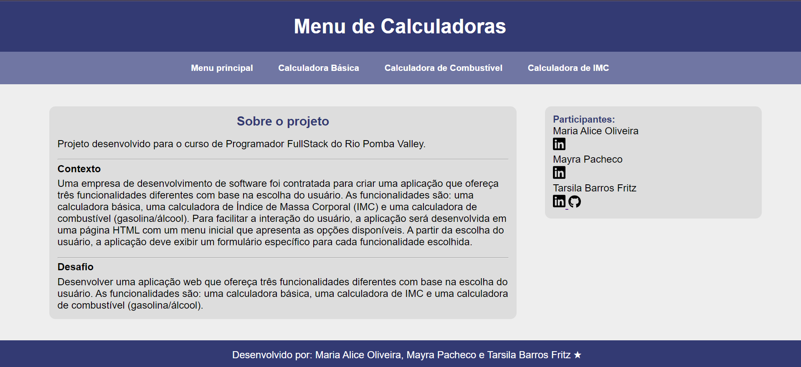

# 🧮 Menu de Calculadoras
Um projeto desenvolvido para a matéria de Codificação Backend do curso Rio Pomba Valley (RPV).

  
 

### 🎯 Objetivo
- Desenvolver uma aplicação web que ofereça três funcionalidades diferentes com base na escolha do usuário. As funcionalidades são: uma calculadora básica, uma calculadora de IMC e uma calculadora de combustível (gasolina/álcool).

### ⚙️ Tecnologias Utilizadas

  
  
  

### 👥 Participantes
- Maria Alice Oliveira
- Mayra Pacheco
- Tarsila Barros Fritz
